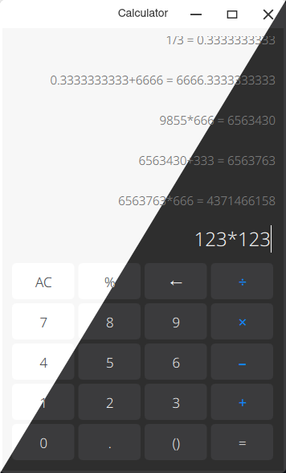

# cyber-calculator

CyberOS Calculator



## Dependencies

On ArchLinux:

```shell
sudo pacman -S gcc cmake qt5-base qt5-quickcontrols2
```

## Build and Install

```
mkdir build
cd build
cmake ..
make
sudo make install
```
