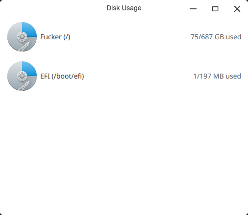
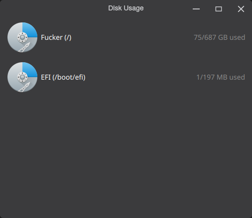

# Cyber Disk Usage
A quick and easy-to-use utility to check your disk's usage.

 

Written by [omame (@omaemae)](https://github.com/omaemae) using parts of [cyber-settings](https://github.com/cyberos/cyber-settings).

Copyright (c) CyberOS Project 2020

## Dependencies
```bash
sudo pacman -S qt5-base qt5-quickcontrols2
```
You'll also need to build/install [MeuiKit](https://github.com/cyberos/meuikit) to use this properly.

## Build and Install
```bash
mkdir build
cd build
cmake ..
make -j$(nproc)
sudo make install
```
