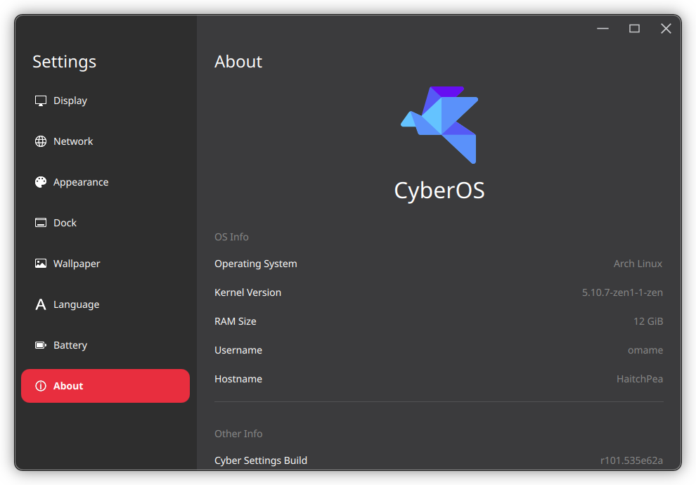

# Cyber Settings

The System Settings application for Cyber Desktop.


## Dependencies

```shell
sudo pacman -S extra-cmake-modules qt5-base qt5-quickcontrols2 freetype2 fontconfig networkmanager-qt modemmanager-qt kcoreaddons
```

## Build

```shell
mkdir build
cd build
cmake ..
make
```

## Install

```shell
sudo make install
```
