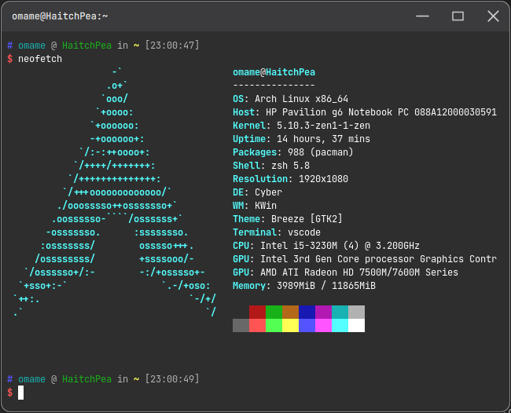

# Cyber Terminal
A simple terminal based on [QMLTermWidget](https://github.com/Swordfish90/qmltermwidget).

## Dependencies
```sh
sudo pacman -S qt5-base qt5-quickcontrols2 qt5-graphicaleffects
```
You will also need [MeuiKit](https://github.com/cyberos/meuikit).

## Build and install
```sh
# Build internal QMLTermWidget fork
cd qmltermwidget
mkdir build
cd build
qmake ..
make -j$(nproc)
make install

# Build Cyber Terminal
mkdir build
cd build
cmake ..
make -j$(nproc)
make install
```
